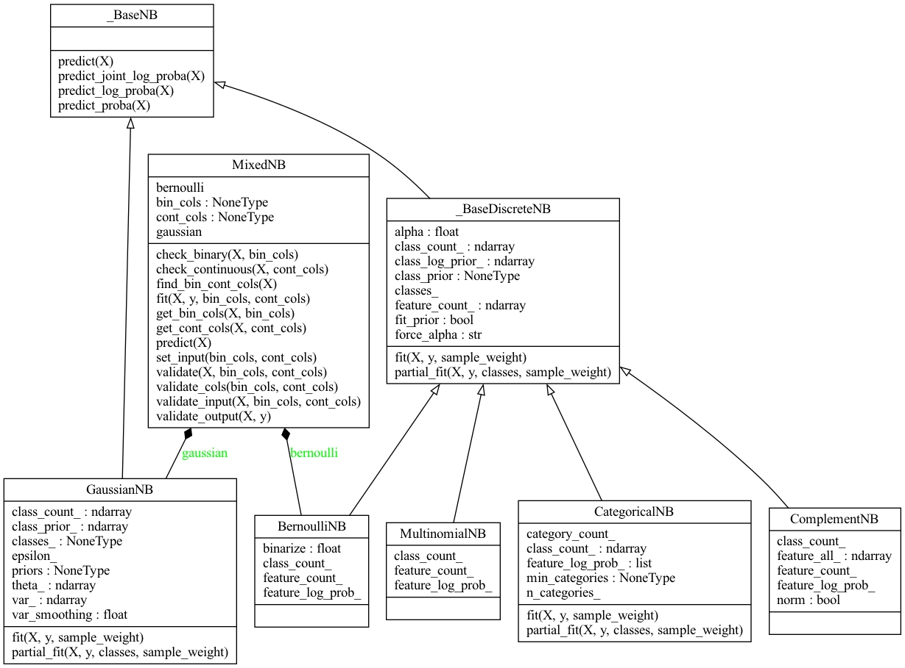
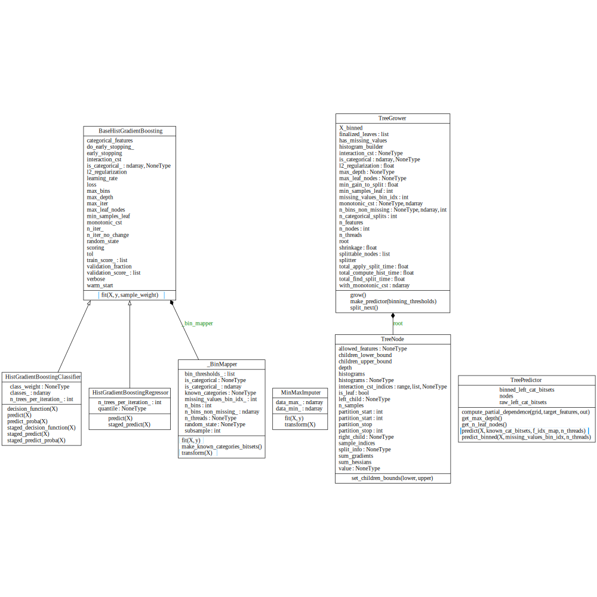

# Documentation of Implemented Issues

## Issue #12957

<blockquote>
    <p>Issue Link: 
        <a href="https://github.com/scikit-learn/scikit-learn/issues/12957">(#12957) Naive Bayes Classifier with Mixed Bernoulli/Gaussian Models </a>
    </p>
    <p>Targeted PR: 
        <a href="https://github.com/simon-yc/d01w23-team-deez/pull/11">(#11) Add MixedNB Classifier </a>
    </p>
    <p>Team member involved (worked together: task implementation, testing, and documentation): 

+ Simon Chau 
+ Linda Shi 
+ Flora Xie 
+ Brandon Lo 

    </p>
</blockquote>

### Files changed
<ul>
    <li>
        <a href="#"><code>/sklearn/naive_bayes.py</code></a>
    </li>
    <li>
        <a href="#"><code>/sklearn/tests/test_naive_bayes.py</code></a>
    </li>
</ul>

### Description and Design of the Implementation:



We introduced a new Naive Bayes classifier in the scikit-learn library, `MixedNB`, which is designed to handle mixed datasets including both binary and continuous features. Our implementation addresses the limitations of scikit-learn's existing Naive Bayes classifiers, more specifically `BernoulliNB` and `GaussianNB`, which are specialized for either binary or continuous features but not both. Using this new class, we are able to provide a prediction given a mixed dataset that includes both binary and continuous values.

The `MixedNB` classifier is designed using composition. This allows us to utilize the strengths of both the `BernoulliNB` and `GaussianNB` classifiers. It combines the predictions of these two classifiers to produce a final prediction given a mixed dataset. More specifically, the `MixedNB` classifier maintains instances of `BernoulliNB` and `GaussianNB` as its attributes and uses them to classify binary and continuous features, respectively, whenever needed.

In the fit method, the class allows users to specify the binary and continuous feature columns, or it can automatically determine them based on the input data. This feature provides flexibility for the user to decide whether or not they want to pass in specific columns, or to allow the class itself to decide which columns are binary or continuous valued. The method then validates the inputs, ensuring that the specified columns are consistent with the data types, and fits the mixed dataset using both the `BernoulliNB` and `GaussianNB` classifiers with the respective feature columns either provided by the user, or auto generated by the class.

When predicting, the `predict` method uses both classifiers to make predictions on their respective feature columns on a given mixed dataset. It then computes the average of the predictions, and returns the final prediction.

As a result, this implementation focuses on maintaining the consistency of the scikit-learn API and providing flexibility to the user to use mixed datasets that include both binary and continuous values. Several validation methods are included to ensure the correctness of input data and to provide meaningful error messages when the input is invalid. By combining the strengths of `BernoulliNB` and `GaussianNB` classifiers, it provides an elegant and efficient way to classify such data while maintaining the consistency and simplicity of scikit-learn's API.

### How the Implementation Addresses the Issue:

The issue in question is handling mixed datasets with both binary and continuous features. This implementation addresses this issue by combining the two Naive Bayes classifiers: one for binary features (Bernoulli Naive Bayes) and another for continuous features (Gaussian Naive Bayes).

By separating the input data into binary and continuous columns, the MixedNB class ensures that each type of feature is handled appropriately by the corresponding Naive Bayes classifier. The validation methods ensure that the input data is formatted correctly, preventing errors during fitting and prediction.

By averaging the predictions from both classifiers, the MixedNB class provides a prediction that takes into account both types of features in the dataset. This allows the classifier to handle mixed datasets effectively, providing accurate predictions for datasets with both binary and continuous features.

### Implementation (Changes made):

The MixedNB class has an initializer that sets up the Bernoulli Naive Bayes and Gaussian Naive Bayes classifiers, as well as the binary and continuous column indices.

```python
def __init__(self):
        self.bernoulli = BernoulliNB()
        self.gaussian = GaussianNB()
        self.bin_cols = None
        self.cont_cols = None
```

The methods of the class can be divided into three main categories:

1. Getters and setters:
    - `get_bin_cols` and `get_cont_cols`: These methods are responsible for extracting binary and continuous columns from the dataset based on the given indices.
    - `set_input`: This method stores the binary and continuous column indices for later use.
2. Validation methods:
    - `check_binary` and `check_continuous`: These methods perform validation checks on binary and continuous columns, ensuring that they contain valid values.
    - `validate_output`: This method validates the output (y) by checking if the number of inputs is equal to the number of outputs and if the output contains only binary values.
    - `validate_input`: This method validates the input (X) by checking if it is a 2D array with a valid shape, if the binary and continuous columns are within the bounds of the dataset, and if the columns contain appropriate values.
    - `validate_cols`: This method validates the binary and continuous column indices by checking if they are lists, if they have at least one element, if they are of the same size, if they are unique, and if they do not overlap.
    - `validate`: This method combines the validation methods mentioned above.
3. Main methods:
    - `fit`: This method is responsible for fitting the classifier to the dataset. It takes the input (X), output (y), and binary and continuous column indices. If the column indices are not provided, it finds them automatically. It performs validation and fits the Bernoulli and Gaussian Naive Bayes classifiers to the respective columns.
    - `predict`: This method is responsible for predicting the output (y) based on the input (X). It validates the input, extracts the binary and continuous columns, and predicts the output using both the Bernoulli and Gaussian Naive Bayes classifiers. The final prediction is an average of the predictions from both classifiers.

### User guide

1.9.7. Mixed Naive Bayes 

`MixedNB` implements the mixed Naive Bayes algorithm for classification, which combines Gaussian Naive Bayes and Bernoulli Naive Bayes classifiers. This classifier is designed to handle datasets with both continuous and binary features. The continuous features are modeled using Gaussian Naive Bayes, while the binary features are modeled using Bernoulli Naive Bayes. 

This classifier requires the input data to have continuous and binary features separated into two distinct sets of columns. The `MixedNB` class can automatically detect binary and continuous columns if not provided during fitting.

1. Specifying Binary and Continuous Columns: `MixedNB` allows you to specify binary and continuous columns during the fitting process. To do so, you can pass the `bin_cols` and `cont_cols` parameters, which are lists of indices representing the binary and continuous columns, respectively.

    ```Python
    mixed_nb.fit(X, y, bin_cols=[0], cont_cols=[1])
    ```

2. Composition of Gaussian and Bernoulli Components: The `MixedNB` classifier uses a combination of Gaussian and Bernoulli components to model the likelihood of continuous and binary features, respectively. During the fitting process, the Gaussian component is fit on the continuous columns, and the Bernoulli component is fit on the binary columns. The final classification is based on the product of the likelihoods from both components. 

    ```Python
    def __init__(self):
      self.bernoulli = BernoulliNB()
      self.gaussian = GaussianNB()
    ```

This classifier is particularly useful when dealing with datasets that have a mix of continuous and binary features, and can provide better classification performance than using either Gaussian or Bernoulli Naive Bayes alone.

### Unit testing

We have multiple unit test cases to test the implementation. Using the `MixedNB` class, we must perform a unit test case on a valid case of the prediction and multiple unit test cases on validations when using this class.

#### Scenario \#1: Predicting a normal case of dataset X (given valid inputs)

```Python
def test_predict_normal_case():
    mixed_nb = MixedNB()
    X_train = np.array([[0, 0, 1, 1],
                        [1, 0, 2, 2],
                        [0, 1, 3, 1],
                        [1, 1, 4, 0]])
    y_train = np.array([0, 1, 1, 0])
    X_test = np.array([[1, 0, 2, 1],
                       [0, 1, 3, 0]])
   
    mixed_nb.fit(X_train, y_train)
    predictions = mixed_nb.predict(X_test)


    # Check if the predictions array is a numpy array
    assert isinstance(predictions, np.ndarray)
    # Check if the predictions array has the correct shape (2,)
    # [-, -] -> 2 elements in the first dimension, second dimension does not exist
    assert predictions.shape == (2, )
    # Check if all predicted labels are either 0 or 1
    assert all(pred in [0, 1] for pred in predictions)
```

#### Scenario \#2 - Validation errors on given inputs to the MixedNB class

There are many validation checks that we must perform before successfully fitting and predicting a mixed dataset using the MixedNB class. The errors that we must check for are listed below:

- `test_validate_cols_error()`
- `test_check_binary_error()`
- `test_validate_output_error()`
- `test_find_bin_cont_cols_error()`
- `test_fit_error()`
- `test_predict_error()`
- `test_check_continuous_error()`
- `test_validate_output_inputs_not_equal()`
- `test_validate_input_not_enough_columns_error()`
- `test_validate_cols_bin_not_unique_error()`
- `test_validate_cols_cont_not_unique_error()`

### User Acceptance Test

As a user, I want to be able to input the titanic dataset that contains both binary and continuous values. I also want the option to pass in and specify the columns I want to use for binary and continuous values. In the end, I want to be able to display the predicted result of a test dataset after training it with a training dataset. 

```Python
import numpy as np
import pandas as pd
from sklearn.model_selection import train_test_split
from sklearn.metrics import accuracy_score
from mixed_naive_bayes import MixedNB

# Load the Titanic dataset
titanic_data = pd.read_csv('titanic.csv')

# Preprocess the dataset
titanic_data = titanic_data[['Survived', 'Pclass', 'Sex', 'Age', 'Fare']]

# Update the variable ‘Sex’ to binary
titanic_data['Sex'] = [1 if sex == ‘male’ else 0 for sex in titanic_data[‘Sex’]]

# Create a new binary feature 'is_adult'
titanic_data['is_adult'] = [1 if age >= 18 else 0 for age in titanic_data[‘Age’]]

# Drop the 'Age' column as it is not needed anymore
titanic_data.drop('Age', axis=1, inplace=True)

# Split the dataset into features (X) and target (y)
X = titanic_data.drop('Survived', axis=1).values
y = titanic_data['Survived'].values

# Split the dataset into training and testing sets
X_train, X_test, y_train, y_test = train_test_split(X, y, test_size=0.2, random_state=42)

# Create an instance of the MixedNB classifier
clf = MixedNB()

# Fit the classifier to the training data
clf.fit(X_train, y_train)

# Make predictions on the test data
y_pred = clf.predict(X_test)

# Calculate and print the accuracy score
accuracy = accuracy_score(y_test, y_pred)
print("Accuracy:", accuracy)
```

Before, I was only able to use datasets that contain only binary values or only continuous values with the Bernoulli and Gaussian classifiers respectively. Now, I am finally able to pass in a dataset that contains both binary and continuous values and use a combination of the two classifiers successfully with the MixedNB class without getting any errors.

<br></br>

# Documentation of Implemented Issues

## Issue #15336

<blockquote>
    <p>Issue Link: 
        <a href="https://github.com/scikit-learn/scikit-learn/issues/15336">(#15336) Add Sparse Matrix Support For <code>HistGradientBoostingClassifier</code>
    </p>
    <p>Targeted PR: 
        <a href="https://github.com/simon-yc/d01w23-team-deez/pull/9">(#9) Add complete support for <code>sparse matrix</code></a>
    </p>
        <p>Team member involved: 

+ Abhay Patel (finding cause of issue and testing)
+ Tanzim Ahmed (testing and task implementation)
+ Tirth Patel (task implementation)
    </p>
</blockquote>

### Files changed
<ul>
    <li>
        <a href="#"><code>scikit-learn-main/sklearn/ensemble/_hist_gradient_boosting/binning.py</code></a>
    </li>
    <li>
        <a href="#"><code>scikit-learn-main/sklearn/ensemble/_hist_gradient_boosting/gradient_boosting.py</code></a>
    </li>
    <li>
        <a href="#"><code>scikit-learn-main/sklearn/ensemble/_hist_gradient_boosting/predictor.py</code></a>
    </li>
    <li>
        <a href="#"><code>scikit-learn-main/sklearn/ensemble/_hist_gradient_boosting/tests/test_binning.py</code></a>
    </li>
    <li>
        <a href="#"><code>scikit-learn-main/sklearn/ensemble/_hist_gradient_boosting/tests/test_gradient_boosting.py</code></a>
    </li>
</ul>

### Description

Gradient boosting classifiers are a kind of machine learning method that joins many weak learning models to make a strong prediction model. Decision trees are often used for this. When these trees are weak learners, or models that work a little better than guessing, they usually do better than random forest models.

Boosting is a way to learn with a group of tree models that are added one by one. Each new tree model tries to fix the mistakes made by the other tree models already in the group.

By breaking down the input data into a few hundred special values using bins, we can make the tree training much faster.

We can also use helpful data structures, like histograms, to show the bins of the input data. The tree building method can be made better to use histograms when making each tree.

Histogram-based gradient boosting ensembles use this way to change the training around the input data. This method helps train decision trees faster in the gradient boosting ensemble. That's why, in new machine learning libraries, a gradient boosting method that uses "histograms" is often called histogram-based gradient boosting.

The problem in this issue happens when we try to use a sparse matrix in the HistGradientBoostingClassifier. This matrix is made by using CountVectorizer and TfidTransformer on some input text. CountVectorizer is used to transform text into a sparse matrix and the TfidTransformer is meant to convert a collection of documents/data into a matrix of TF-IDF features. The purpose of TfidTransformer is to scale down the impact of tokens that occur very frequently in the matrix which essentially acts as a dense matrix, however it can return a sparse matrix. The default behaviour when returning a sparse matrix is to throw a TypeError, which is explained more later on.

This improvement for the HistGradientBoostingClassifier tries to make it possible to use sparse matrices as input without raising an error.

### Steps to Reproduce

```python
import pandas as pd
from sklearn.feature_extraction.text import CountVectorizer, TfidfTransformer
from sklearn.ensemble import HistGradientBoostingClassifier

df = pd.read_csv("path_to_sparse_matrix_data.csv")

vectorizer = CountVectorizer()
tfidf = TfidfTransformer()
clf = HistGradientBoostingClassifier()

vecs = vectorizer.fit_transform(df.loc[:, "very_large_text"])
vecs = tfidf.fit_transform(vecs)

clf.fit(vecs, df.loc[:, "label"])

```

<code>csv</code> file used for testing:
```csv
id,very_large_text,label
0,this is testing datathis is testing datathis is testing datathis is testing datathis is testing datathis is testing datathis is testing datathis is testing datathis is testing datathis is testing data,3
1,this is testing datathis is testing datathis is testing datathis is testing datathis is testing datathis is testing data,2
2,this is testing datathis is testing datathis is testing datathis is testing datathis is testing datathis is testing datathis is testing datathis is testing data,5
3,this is testing datthis is testing datathis is testing datathis is testing datathis is testing datathis is testing datathis is testing datathis is testing datathis is testing datathis is testing datathis is testing datathis is testing datathis is testing datathis is testing datathis is testing datathis is testing datathis is testing datathis is testing datathis is testing datathis is testing datathis is testing datathis is testing datathis is testing datathis is testing datathis is testing datathis is testing datathis is testing datathis is testing datathis is testing datathis is testing datathis is testing datathis is testing datathis is testing datathis is testing datathis is testing datathis is testing datathis is testing datathis is testing dataa,4
```

#### Exprected Result
```python
No error is thrown
```

#### Actual Result
```python
TypeError: A sparse matrix was passed, but dense data is required. Use X.toarray() to convert to a dense numpy array.
```
### Implementation



The above diagram shows the changes that we have made for our implementation highlighted in blue. The main changes are in the <code>fit</code> and <code>transform</code> methods of the <code>BinMapper</code> class. The <code>fit</code> method is used to fit the sparse matrix into the bins. The <code>transform</code> method is used to transform the sparse matrix into a dense matrix.

#### <code>Fit</code> Method

When adjusting the sparse matrix after calling the fit() method, it can be changed to a dense one since only unique values matter. This is done by taking the non-empty values and adding 0 to the list of values. Now, the matrix can be handled like a dense one. This helps to prevent copying the code and testing a new method.

#### <code>Transform</code> Method

The main issue here is that we want the bin with the value 0 to be set to the value 0. This way, we can use the sparse structure to treat missing values as 0.

In the resulting matrix, values in the bins from 0 to just before actual_bin_zero are moved one space to the right, and the bin actual_bin_zero is set to 0.

The transform function gives back actual_bin_zero along with the matrix.

So, the whole process for the transform method can be explained like this:

1. We give a 1x1 matrix filled with zeros to _map_to_bins to find the actual_bin_zero.
2. We change the sparse matrix to a dense one (explained more below).
3. We give the packed matrix to _map_to_bins to change the bins.
4. We move the changed bins.
5. We change the dense matrix back to a sparse one, keeping the original structure.

#### The Packing Process 
To let _map_to_bins work with a sparse matrix, we change it to a dense one. We do this for each column, and the new matrix is the smallest size that can hold the data. The function gives back the packed matrix and the row numbers of the earlier values.

To unpack the matrix, we do the opposite - we use the row numbers to put the values in the right place in the sparse matrix.

These changes have been added to the _find_binning_thresholds method in binning.py, along with a few small changes in gradient_boosting.py and predictor.py.

Since this isn't a new feature, it doesn't change the overall structure of scikit-learn or how it's designed. Instead, it makes the Histogram-Based Gradient Boosting better by showing correct results for sparse matrices when using the method that supports it - HistGradientBoostingClassifier.

### User Guide

<a href="https://scikit-learn.org/stable/modules/ensemble.html#histogram-based-gradient-boosting"> Guide for Histogram-Based Gradient Boosting from the official scikit-learn documentation </a>

The issue we picked doesn't impact the user guide because it's not a new feature. Most of the changes are in the ```_find_binning_thresholds method```, along with two new private helper methods, ```convert_to_dense_matrix``` and ```convert_to_sparse_matrix```. Because these methods are private, they don't change the overall structure of the library. Also, the updated classes in this improvement don't use these helpers as methods; instead, they call these helpers within the existing class methods.

### Testing

We need to test the changes in two main situations. First, we test ```gradient_boosting``` with a sparse matrix input, and second, we test the changes made to the ```_find_binning_thresholds```

#### Scenario #1: ```gradient_boosting ```

```python
def test_gradient_boosting_with_sparse_matrix():
    # Create a numpy array with new sample data
    data = np.array([5, 2, 1, np.nan, 4]).reshape(-1, 1)
    # Convert the numpy array to a Compressed Sparse Row (CSR) matrix
    sparse_sample = sp.csr_matrix(data)
    # Define new target values for the sample data
    target_values = [3, 1, 4, 5, 2]
    # Instantiate a HistGradientBoostingClassifier with a minimum samples per leaf of 1
    classifier = HistGradientBoostingClassifier(min_samples_leaf=1)
    # Train the classifier using the sparse sample data and target values
    classifier.fit(sparse_sample, target_values)
    # Predict the target values using the trained classifier
    predictions = classifier.predict(sparse_sample)
    # Assert that the predictions match the original target values
    assert np.array_equal(predictions, target_values), f"Expected {target_values}, but got {predictions}"
```

#### Scenario #2: ```_find_binning_thresholds```

```python
def test_sparse_matrix_find_binning():
    # creates an evenly spaced array with 5 values ranging from 0 to 15
    linspace_array = np.linspace(0, 12, 9)
    y_axis = [x for x in range(9)]
    x_axis = [0 for _ in range(9)]
    # pairs each corresponding row and column with each of the values in data
    linspace_array = sp.csr_matrix((linspace_array, (y_axis, x_axis)), (10, 1))
    # map the data into bins
    get_bin = _find_binning_thresholds(linspace_array, max_bins=5)
    assert(get_bin, [0.75, 3.75, 6.75, 9.75])
```

### Customer Acceptance Test

Use the same code piece mentioned in the ```Steps to Reproduce``` section.

```python
import pandas as pd
from sklearn.feature_extraction.text import CountVectorizer, TfidfTransformer
from sklearn.ensemble import HistGradientBoostingClassifier

df = pd.read_csv("path_to_sparse_matrix_data.csv")

vectorizer = CountVectorizer()
tfidf = TfidfTransformer()
clf = HistGradientBoostingClassifier()

vecs = vectorizer.fit_transform(df.loc[:, "very_large_text"])
vecs = tfidf.fit_transform(vecs)

clf.fit(vecs, df.loc[:, "label"])

```

<code>csv</code> file used for testing:
```csv
id,very_large_text,label
0,this is testing datathis is testing datathis is testing datathis is testing datathis is testing datathis is testing datathis is testing datathis is testing datathis is testing datathis is testing data,3
1,this is testing datathis is testing datathis is testing datathis is testing datathis is testing datathis is testing data,2
2,this is testing datathis is testing datathis is testing datathis is testing datathis is testing datathis is testing datathis is testing datathis is testing data,5
3,this is testing datthis is testing datathis is testing datathis is testing datathis is testing datathis is testing datathis is testing datathis is testing datathis is testing datathis is testing datathis is testing datathis is testing datathis is testing datathis is testing datathis is testing datathis is testing datathis is testing datathis is testing datathis is testing datathis is testing datathis is testing datathis is testing datathis is testing datathis is testing datathis is testing datathis is testing datathis is testing datathis is testing datathis is testing datathis is testing datathis is testing datathis is testing datathis is testing datathis is testing datathis is testing datathis is testing datathis is testing datathis is testing dataa,4
```

Instead of seeing a TypeError now, the user doesn't get any output, which is what we expect.

```shell
tanzim@DESKTOP-F5EEQ36:/mnt/c/Users/Tanzim Ahmed/d01w23-team-deez2$ python3 test.py
tanzim@DESKTOP-F5EEQ36:/mnt/c/Users/Tanzim Ahmed/d01w23-team-deez2$ 
```